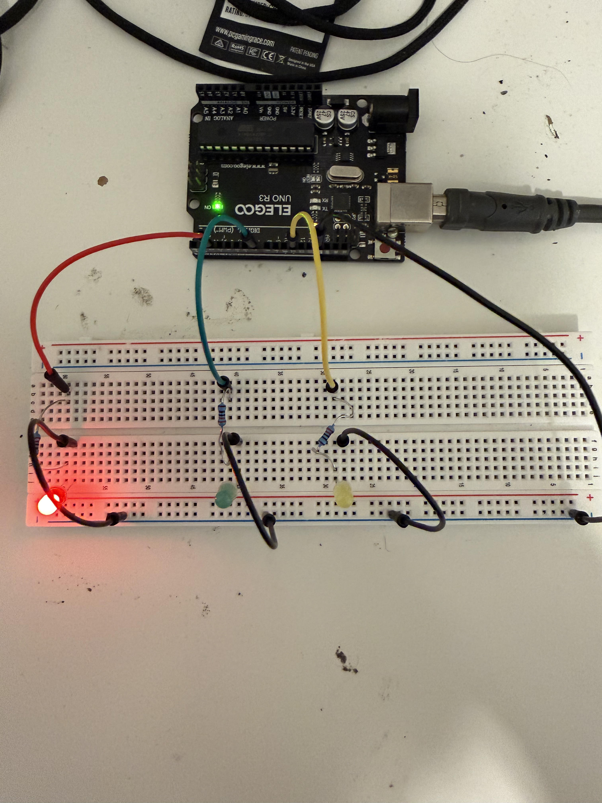

# Traffic Light System (LED Sequencing)

## Project Overview
This project uses **three LEDs** and an **Arduino** to simulate a real traffic light system.  
The lights cycle through **red → green → yellow → red**, just like an actual intersection.

This project introduces **timing**, **sequencing**, and **automation systems**.

---

## Learning Objectives
By completing this project, students will:

- Understand how real-world systems use **timed sequences**
- Control multiple **LED outputs**
- Learn how automation works using **delay timing**
- See how software can control **real infrastructure**
- Practice building organized circuits

---

## Materials Required
- **Arduino Uno**
- **Red LED**
- **Yellow LED**
- **Green LED**
- **3 × 220Ω resistors**
- **Breadboard**
- **Jumper wires**
- **USB cable**

---

## Circuit Wiring

Each LED connects through a resistor to prevent damage.

**Red LED**
1. **Pin 2 → 220Ω resistor → Red LED → GND**

**Green LED**
1. **Pin 7 → 220Ω resistor → Green LED → GND**

**Yellow LED**
1. **Pin 11 → 220Ω resistor → Yellow LED → GND**

Long leg of LED = positive  
Short leg = GND

---

## How It Works

The Arduino turns LEDs on and off in a timed cycle:

1. **Red light ON**
2. **Green light ON**
3. **Yellow light ON**
4. Cycle repeats

Each light stays on for a set time before switching.

The program uses:

- **digitalWrite()** to control LEDs
- **delay()** for timing
- **output sequencing** to simulate a real system

---

## Expected Behavior

After uploading the program:

- Red light turns on first
- Green light turns on next
- Yellow light turns on last
- The cycle repeats continuously

The system behaves like a real traffic signal.

---

## Key Concepts Introduced
- **Sequencing**
- **Timed automation**
- **Multiple outputs**
- **System modeling**
- **Real-world engineering**

---

## Troubleshooting

**LED not lighting**
- Check resistor placement
- Confirm LED polarity

**Lights stay on or don’t change**
- Verify wiring to pins 2, 7, and 11
- Confirm code uploaded correctly

**Wrong LED turns on**
- Check wires are connected to the correct pins

---

## Extension Ideas

- Add a **pedestrian button**
- Add a **buzzer** for crossing alerts
- Build a **two-direction intersection**
- Change timing for different traffic patterns
