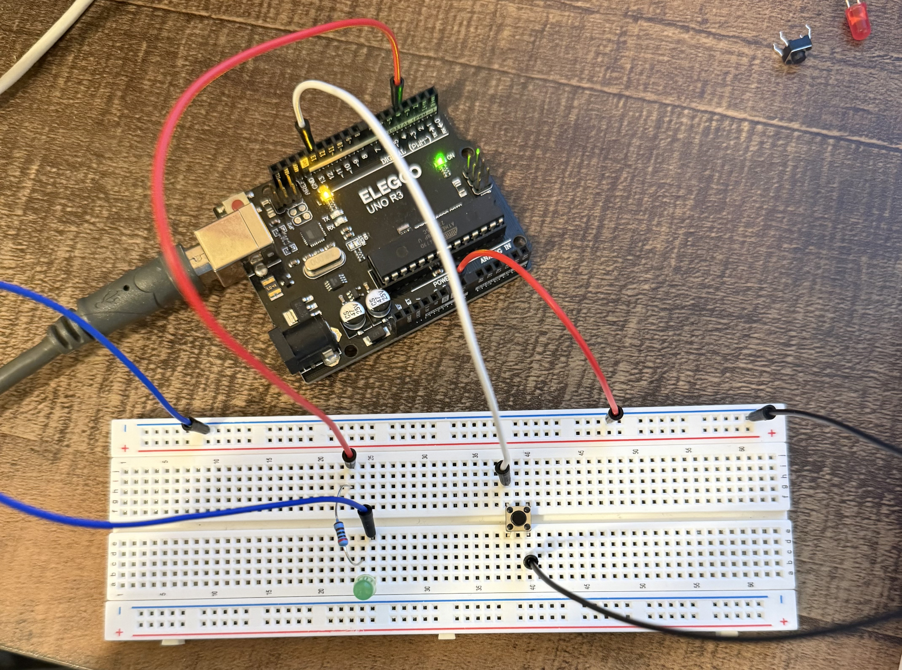

# Button-Controlled LED Toggle

## Project Overview
This project uses a **push button** to turn an LED **ON and OFF** using an Arduino.  
Each button press toggles the LED state, demonstrating how a microcontroller can **read inputs, remember states, and control outputs**.

This project introduces **digital input**, **state memory**, and **basic debouncing**.

---

##  Learning Objectives
By completing this project, students will:
- Understand how a **push button** works
- Use **digital inputs and outputs**
- Learn what **INPUT_PULLUP** means
- Understand how a program can **remember a previous state**
- Build a toggle system with one button

---

##  Materials Required
- Arduino Uno
- Push button
- LED
- 330Ω resistor
- Breadboard
- Jumper wires
- USB cable

---

## Circuit Wiring

### Button Wiring (INPUT_PULLUP)
1. Place the button so it **overhangs over the breadboard center gap**
2. One leg of the button → **Pin 2**
3. Opposite leg of the button → **GND**

⚠️ No resistor is needed for the button when using `INPUT_PULLUP`.

---

### 💡 LED Wiring
1. **Pin 4 → LED long leg (+)**
2. LED short leg (–) → **330Ω resistor**
3. Other end of resistor → **GND**

