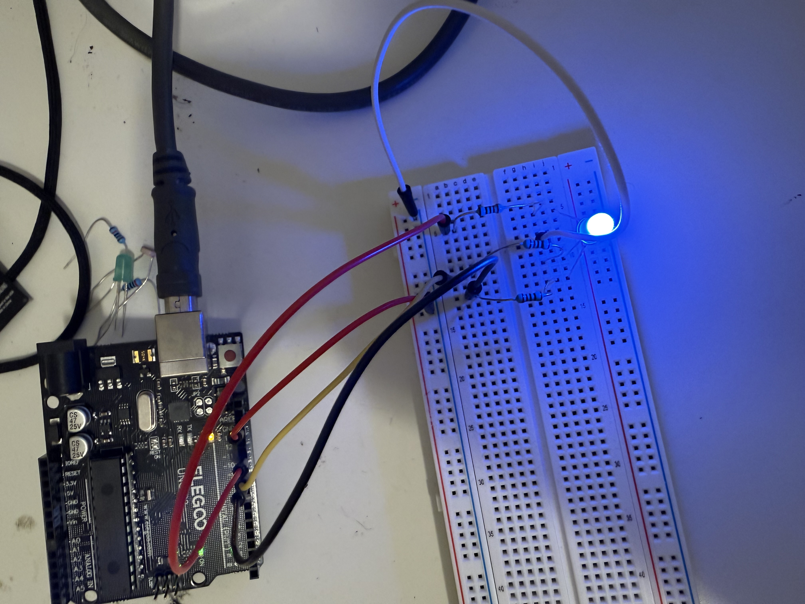

# RGB Color Mixer (PWM Color Control)

## Project Overview
This project uses an **RGB LED** and **Arduino PWM outputs** to create a smooth color-changing light.  
Instead of turning an LED only **ON** or **OFF**, the Arduino controls the brightness of **red**, **green**, and **blue** channels to mix colors.

The LED continuously cycles through different colors like a rainbow.

This project introduces **PWM**, **multiple outputs**, and **color mixing**.

---

## Learning Objectives
By completing this project, students will:

- Understand how an **RGB LED** works  
- Learn how **Arduino** controls brightness using **PWM**  
- Use **`analogWrite()`** to control **LED intensity**  
- Combine **multiple outputs** to create new colors  
- Observe how **software** controls **physical hardware**  

---

## Materials Required
- **Arduino Uno**
- **RGB LED (common cathode)**
- **3 × 220Ω resistors**
- **Breadboard**
- **Jumper wires**
- **USB cable**

---

## Circuit Wiring

### RGB LED Connections

RGB LEDs have **four legs**. The longest leg is usually the **common ground**.

**Steps:**

1. Longest leg → **GND**
2. Red leg → **Pin 9** through a **220Ω resistor**
3. Green leg → **Pin 10** through a **220Ω resistor**
4. Blue leg → **Pin 11** through a **220Ω resistor**

Pins **9**, **10**, and **11** are **PWM pins** used for **brightness control**.

---

## How It Works

An **RGB LED** contains **three LEDs** inside:

- **Red**
- **Green**
- **Blue**

Each one is controlled separately using **PWM signals**.

Arduino sends **brightness values** from **0–255**:

- **0 = off**
- **255 = full brightness**

By combining **brightness levels**, the Arduino mixes colors to create **smooth transitions**.

---

## Expected Behavior

After uploading the program:

- The **RGB LED** slowly changes colors  
- It fades from **red → yellow → green → blue → purple**  
- The pattern repeats continuously  

---

## Key Concepts Introduced
- **PWM (Pulse Width Modulation)**  
- **analogWrite()**  
- **Multi-output control**  
- **Color mixing**  

---

## Troubleshooting

**LED not lighting**
- Check **resistor placement**
- Confirm longest leg is connected to **GND**

**Colors appear incorrect**
- **RGB wires** may be swapped  
- Try switching pins **9**, **10**, and **11**

**LED is very dim**
- You may be using a **common anode RGB LED**
- This requires **different wiring** and **inverted code**
