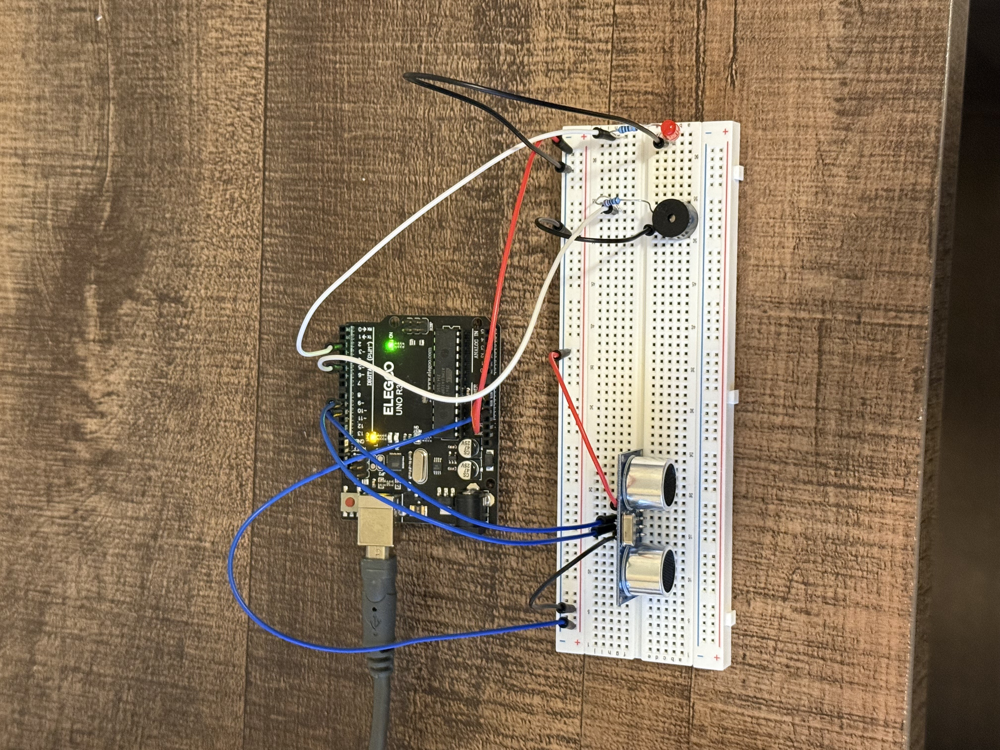

# Ultrasonic Distance Alert (LED + Passive Buzzer)

This project uses an **ultrasonic distance sensor** to detect how close an object is and then controls **both an LED and a passive buzzer** together.

As an object gets closer:
- The **LED blinks faster**
- The **buzzer beeps faster**

When the object is far away, everything stays silent and off.

---

## What You Should See & Hear

### Hand far away (> 30 cm)
- 🔇 Buzzer: OFF (silent)
- 💡 LED: OFF

### Hand inside 30 cm
- 🔊 Buzzer: Beeping
- 💡 LED: Blinking

### Hand very close
-  Buzzer: Beeping very fast
-  LED: Blinking very fast

The LED and buzzer are **perfectly synchronized**.

---

## Why This Works

The ultrasonic sensor measures **distance** by sending out a sound pulse and timing how long it takes to return.

The Arduino:
1. Converts that time into a **distance**
2. Uses the distance to calculate a **delay**
3. Uses the same delay to control **both outputs**

Key lines in the code:

```cpp
digitalWrite(buzzerPin, HIGH);
digitalWrite(ledPin, HIGH);
```
