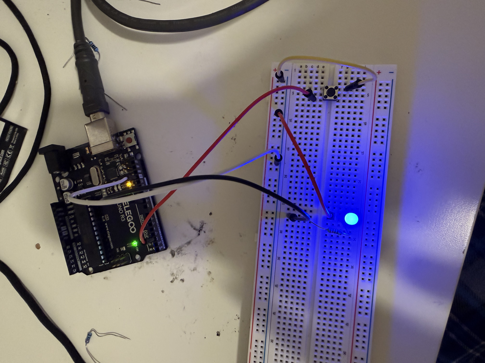

# Reaction Time Game (Timing & Random Delay)

## Project Overview
This project uses an **LED**, a **push button**, and an **Arduino** to measure human reaction time.  
The Arduino waits for a **random amount of time**, turns the LED **ON**, and the player must press the button as fast as possible.

The Arduino then calculates and displays the **reaction time in milliseconds** using the **Serial Monitor**.

This project introduces **timing**, **random behavior**, and **user interaction**.

---

## Learning Objectives
By completing this project, students will:

- Understand how computers use **timing**
- Learn how to generate **random delays**
- Measure real-world actions using **millisecond timing**
- Use **buttons** for user input
- Observe how software responds to human interaction

---

## Materials Required
- **Arduino Uno**
- **LED**
- **220Ω resistor**
- **Push button**
- **Breadboard**
- **Jumper wires**
- **USB cable**

---

## Circuit Wiring

### LED Wiring

**Steps:**

1. **Pin 9 → 220Ω resistor → LED long leg (+)**
2. LED short leg (–) → **GND**

---

### Button Wiring

**Steps:**

1. One side of button → **Pin 2**
2. Other side of button → **GND**

The program uses **INPUT_PULLUP**, so no extra resistor is required.

---

## How It Works

The Arduino:

1. Waits for a **random delay**
2. Turns the **LED ON**
3. Starts measuring time using **millis()**
4. Waits for the player to press the button
5. Calculates and prints the **reaction time**

Reaction time is shown in the **Serial Monitor**.

---

## Expected Behavior

After uploading the program:

- The LED stays **OFF**
- After a random delay, the LED turns **ON**
- The player presses the button quickly
- Reaction time appears in the **Serial Monitor**
- The game resets and repeats

---

## Key Concepts Introduced
- **millis() timing**
- **Random delay**
- **Digital input**
- **User interaction**
- **Human response measurement**

---

## Troubleshooting

**LED not lighting**
- Check resistor placement
- Verify LED polarity (long leg = +)

**Button not working**
- Confirm one side is connected to **Pin 2**
- Confirm other side is connected to **GND**

**No reaction time showing**
- Make sure **Serial Monitor** is open
- Baud rate must be **9600**

---

## Extension Ideas

- Add a **buzzer** when LED turns ON
- Add a **score system**
- Compete with friends for fastest reaction time
- Add multiple LEDs for difficulty levels
