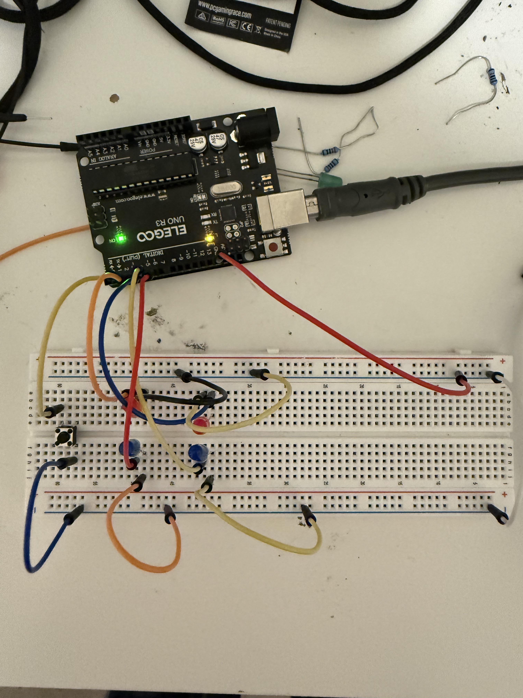

# Digital Dice (4 LED Random Number Generator)

## Project Overview
This project uses **four LEDs**, a **push button**, and an **Arduino** to simulate a digital dice.  
When the button is pressed, the Arduino generates a **random number from 1–6** and displays it using different LED patterns.

This project introduces **random number generation**, **digital outputs**, and **interactive input**.

---

## Learning Objectives
By completing this project, students will:

- Understand how computers generate **random numbers**
- Learn how to control **multiple LEDs**
- Use a **push button** as an input device
- Observe how software creates **interactive behavior**
- Connect user actions to hardware responses

---

## Materials Required
- **Arduino Uno**
- **4 LEDs**
- **4 × 220Ω resistors**
- **Push button**
- **Breadboard**
- **Jumper wires**
- **USB cable**

---

## Circuit Wiring

### LED Connections

Each LED is connected through a resistor to prevent damage.

**Steps:**

1. **Pin 3 → 220Ω resistor → LED → GND**
2. **Pin 4 → 220Ω resistor → LED → GND**
3. **Pin 5 → 220Ω resistor → LED → GND**
4. **Pin 6 → 220Ω resistor → LED → GND**

Arrange LEDs in a square layout:

LED1     LED2  
LED3     LED4  

---

### Button Wiring

**Steps:**

1. One side of button → **Pin 2**
2. Other side of button → **GND**

The program uses **INPUT_PULLUP**, so no extra resistor is required.

---

## How It Works

The Arduino waits for the button to be pressed.

When pressed:

1. The program generates a **random number between 1 and 6**
2. LEDs turn on in a specific pattern representing the number
3. The LEDs remain lit for a short time before resetting

The program uses:

- **random()** to generate numbers
- **digitalWrite()** to control LEDs
- **INPUT_PULLUP** for simple button wiring

---

## Expected Behavior

After uploading the program:

- Press the button
- LEDs rapidly change during the “rolling” animation
- LEDs stop on a final pattern
- The pattern represents a number from **1–6**

Each press creates a new random result.

---

## Key Concepts Introduced
- **Random number generation**
- **Digital output control**
- **User input**
- **Interactive systems**
- **Event-driven programming**

---

## Troubleshooting

**LEDs not lighting**
- Check resistor placement
- Verify LED polarity (long leg = positive)

**One LED never turns on**
- Check wiring to the correct pin
- Make sure it connects to GND through a resistor

**Button not working**
- Confirm one side connects to **Pin 2**
- Confirm the other side connects to **GND**

**Dice rolls repeatedly**
- Hold and release button once instead of pressing rapidly

---

## Extension Ideas

- Add more LEDs to create a full dice face
- Add a buzzer when rolling
- Track scores between players
- Display numbers using the Serial Monitor
