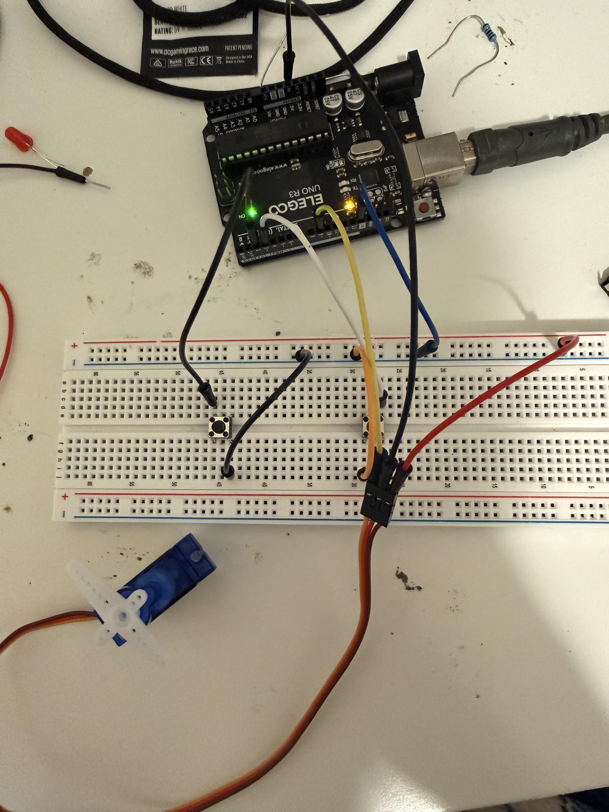

# Password Lock (Servo Controlled)

## Project Overview
This project uses an **Arduino**, **two push buttons**, and a **servo motor** to create a digital password lock.  
Students enter a secret code using the buttons. If the sequence is correct, the servo rotates to the **unlock** position. If the sequence is incorrect, the system stays locked.

This project introduces **input sequences**, **decision making**, and **real-world control systems**.

---

## Learning Objectives
By completing this project, students will:

- Understand how computers check a **password sequence**
- Use **push buttons** for input
- Control a **servo motor** using Arduino
- Learn basic **state logic**
- See how software controls a **physical mechanism**

---

## Materials Required
- **Arduino Uno**
- **Servo motor (SG90 or similar)**
- **2 push buttons**
- **Breadboard**
- **Jumper wires**
- **USB cable**

---

## Circuit Wiring

### Servo Connections
**Steps:**

1. Servo signal wire → **Pin 9**
2. Servo red wire → **5V**
3. Servo brown/black wire → **GND**

---

### Button Wiring

The program uses **INPUT_PULLUP**, so no extra resistors are needed.

**Button 1**
1. One leg → **Pin 2**
2. Other leg → **GND**

**Button 2**
1. One leg → **Pin 3**
2. Other leg → **GND**

---

## How It Works

The Arduino waits for button presses.

Students enter a password sequence using:

- Button 1 → represents “1”
- Button 2 → represents “2”

Example password:
**1, 2, 2, 1**

If the sequence is correct:
- Servo rotates to **unlock**
- Waits briefly
- Returns to **locked**

If the sequence is incorrect:
- Servo remains locked
- System resets for another attempt

---

## Expected Behavior

After uploading the program:

- Servo starts in the **locked position**
- Students press buttons to enter a code
- Correct sequence → servo unlocks
- Incorrect sequence → no unlock

The system resets after each attempt.

---

## Key Concepts Introduced
- **User input**
- **Password logic**
- **Servo control**
- **Conditional statements**
- **Physical system control**

---

## Troubleshooting

**Servo does not move**
- Check signal wire is connected to **Pin 9**
- Confirm power wires are connected correctly

**Buttons not responding**
- Confirm wiring to **Pin 2** and **Pin 3**
- Make sure other side connects to **GND**

**Servo moves randomly**
- Check shared **GND**
- Ensure wires are secure

**Arduino resets when servo moves**
- Servo may need more power than USB provides
- Use external 5V supply if needed

---

## Extension Ideas

- Add an LED for **locked/unlocked**
- Add a buzzer for incorrect password
- Change the password sequence
- Use more buttons for longer passwords
- Connect servo to a real latch or mechanism
